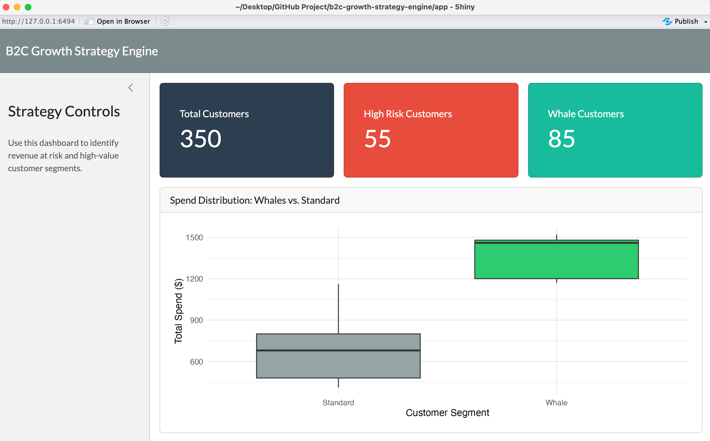

# B2C Growth Strategy Engine

An automated data pipeline and interactive dashboard designed to help e-commerce teams identify high-value customers ("Whales") and flag revenue at risk from churn.

I built this project to bridge the gap between raw data and product strategy. Instead of analyzing a static CSV, this is an end-to-end tool that pulls data via API, applies business logic, and serves the insights to a stakeholder-ready front-end.

## Tech Stack

-   Data Engineering (Backend): Python (Pandas, NumPy, Kaggle API)
-   Dashboarding (Frontend): R (Shiny, bslib, ggplot2)
-   Version Control: Git & GitHub

## The Business Logic

The Python pipeline (scripts/pipeline.py) acts as the engine. It downloads raw customer behavior data and engineers three key features: 1. Churn Risk: Flags users who haven't made a purchase in over 40 days. 2. User Segmentation: Isolates the top 25% of spenders and categorizes them as "Whales" vs. "Standard" users. 3. Revenue at Risk: Calculates the exact dollar amount tied to high-risk customers.

## The Dashboard

The R Shiny app (app/app.R) acts as the presentation layer. It features: \* Top-line KPI tracking (Total Users, High Risk Customers, Whale Customers). \* A clean, modern UI built with the bslib package. \* A ggplot2 distribution visualization highlighting the financial impact of the Whale segment.

## How to Run Locally

1.  Run the Data Pipeline (Python) Ensure you have your Kaggle API credentials set as environment variables. This script will download the raw data, process the business logic, and output a clean processed_data.csv file into the app/ folder.

    ``` bash
    python scripts/pipeline.py
    ```

2.  Launch the Dashboard (R) Open app/app.R in RStudio and click Run App, or run the following command in your R console:

    ``` r
    shiny::runApp("app")
    ```
